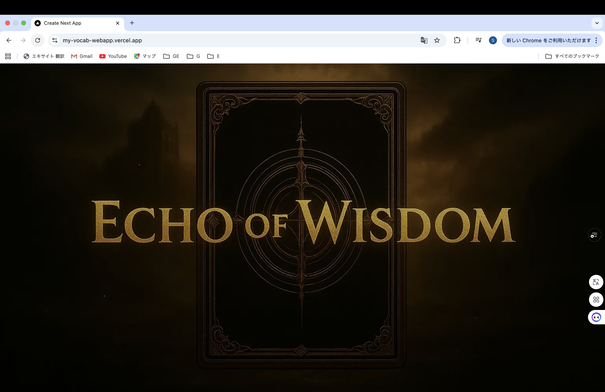
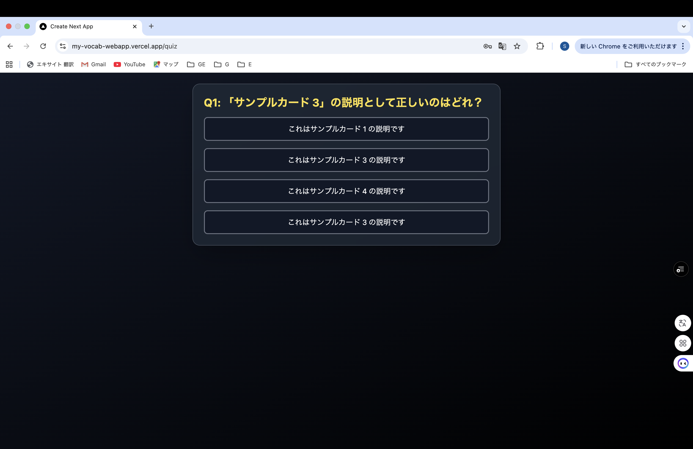
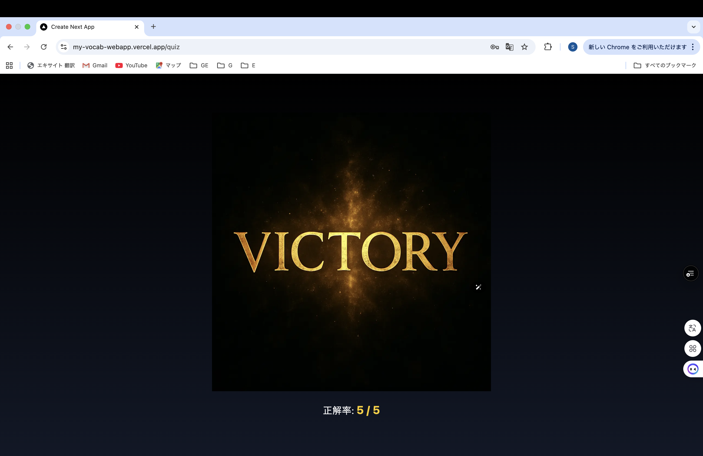

# 🌙 Echo of Wisdom - 記憶力パワーアップカードコレクション

> 覚えられないあの文章や単語もコレクションにすれば覚えられる！そんな発想から作り始めたアプリです。  
> わくわくしながら知識を深められる、体験型クイズ学習アプリ（間違えたカードはクイズに出てきやすくする予定です。）

---


## 🔥 概要

Echo of Wisdom は、自身で作成したカードをクイズで楽しく学べるアプリです。  
**ユーザーの記憶定着や継続性を意識したUI設計**が特徴です。

- 作成者：修田　創（@GitHubユーザー名　ShuuReglus）
- 技術スタック：Next.js / Firebase / Tailwind CSS / TypeScript
- 対象ユーザー：学びを楽しみたい初学者〜中級者、学生、学習が必要な社会人。

---

## 🎮 主な機能

- ✅ クイズ回答 → 自動採点
- 🛠 クイズ作成機能（画像アップ対応予定）
- 📅 ログイン、ログアウト、ゲストサービス利用後データ維持したまま登録可能な機能
- 📊 カード閲覧機能


---

## 🚀 使用技術

| 技術         | 用途                      |
|--------------|---------------------------|
| **Next.js**  | フロントエンド + ルーティング |
| **Firebase** | 認証 / DB / ストレージ     |
| **Tailwind CSS** | UI スタイリング           |
| **TypeScript** | 型安全な開発              |

---

## 🖼️ UIプレビュー



---

## 🧪 ローカルでの起動方法

```bash

npm install
npm run dev
ブラウザで http://localhost:3000 にアクセス

🙌 工夫したポイント
ユーザーに飽きさせない「感情ベース」のUI動線設計

クイズ生成時のUXを考慮したドラッグ＆ドロップ対応

全問正解時には違う演出を出す等

📮 今後の展望


🎉 スコアランキング機能

🧩 他ユーザーのカードでクイズ

📕 間違えたカードを仕分けてポイントなどでクリアしたくなる仕組みの構築等

## 🌐 デモサイト

▶️ アプリを体験してみる → https://my-vocab-webapp.vercel.app

### 💡 こんなことができます

- クイズ形式で直感的に楽しめる学習体験
- ゲーム風の演出でユーザーを惹きつける
- Firebase 認証によるログイン機能
- ユーザーごとのプロフィール表示（後々スコア保存等も）

### 🖼️ ホームページの特徴

- スクロールで月が追従するダイナミックなヒーローセクション
- 画像とメッセージがユーザーが来たときにフェードイン表示されるUX
- 筆記体フォントによる印象的なメッセージ演出、３D天体や星による演出
- UI は Tailwind CSS + Next.js で構築し、パフォーマンスとアクセシビリティも考慮

---


